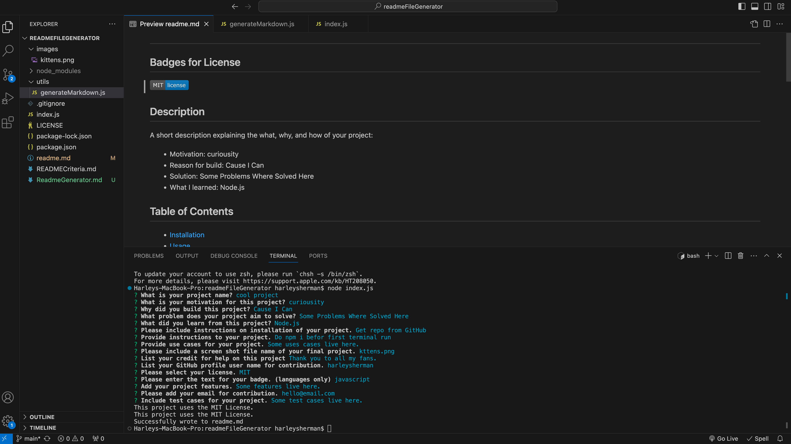
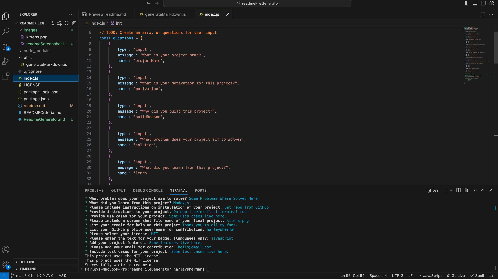
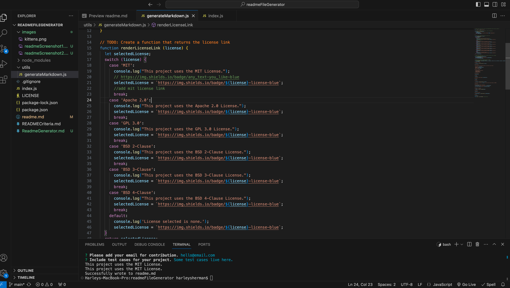

# <readmeFileGenerator>

## Description

Provide a short description explaining the what, why, and how of your project. Use the following questions as a guide:

- My motivation is to learn how to generate a readme file to make it faster when doing projects.
- I built this project to help sped up my coding process.
- This project generates a readme.
- I learned how to use node.js and javascript to make a file and input user information.

## Table of Contents (Optional)

If your README is long, add a table of contents to make it easy for users to find what they need.

- [Installation](#installation)
- [Usage](#usage)
- [Credits](#credits)
- [License](#license)

## Installation

Download repo from github, npm i to install inquirer and fs, then run and debug program as needed on local device.

## Usage

The use case is to generate a readme.md file.

## Credits

I want to thank Leif for helping me restructure my js files so that it was not all done in index.js and guiding me through linking my badges. I want to also thank Charles for assisting me in understanding modularization, promises, and linking github and email.

## License

The license used in this project is the MIT license.

---
## Badges

There are no badges at this time.

## Features

The features are as follows:
- generate a readme.md file based on user input
- ask user for readme information through the terminal

## How to Contribute

There are no contributions at this time.

## Tests

Some test cases are listed below:
- Enter input for reamdme in the terminal, then the readme.md will popluate in realtime in VS code.
- Enter a langauge for a regular badge and it will appear in the readme.md.